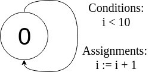

# verifier

Verifier of LTL formula specification on automatons.

### Usage

```text
> cd <project root>
> ./gradlew build
> cp build/libs/verifier-1.0.jar verifier.jar
> java -jar verifier.jar <automaton> <LTL formula wrapped in "">
```

### Automaton format

Automaton is specified using JSON

```json
{
  "name": "loop",
  "variables": [
    {
      "name": "i",
      "type": "int",
      "value": 0
    }
  ],
  "states": [
    0
  ],
  "start": 0,
  "transitions": [
    {
      "from": 0,
      "to": 0,
      "condition": "i < 10",
      "assignments": [
        "i := i + 1"
      ]
    }
  ]
}
```

corresponding to automaton 

 
 
that loops 10 times in the only state. 

- `name` - presentable automaton name
- `variables` - variables encountered on automaton transitions
    - name - unique variable name
    - type - either `int` or `bool`
    - value - initial value in the start state
- `states` - set of automaton's states
- `start` - initial state of automaton
- `transitions` - transitions in automaton from states to states 
    - `from` - initial state
    - `to` - final state
    - `condition` - boolean expression to be satisfied to active a transition
    - `assignments` - assignments of global variables that happen when the automaton goes by an activated transition,
    in form `<variable> := <arithmetic expression>`

### LTL formula format

LTL formulas are specified using the syntax below. Only propositions about variables' values can be made in the formulas, 
not about states or transitions. The latter may be easily simulated by introducing special variables *state* and *transition* 
and updating their values accordingly.

```
φ ::= ( φ ) | expression | !φ | X φ | F φ | G φ | φ U φ | φ R φ | φ & φ | φ '|' φ | φ -> φ 
expression := arithmetic ((= | != | < | <= | > | >=) arithmetic)?
arithmetic := term ( (+ | -) term)*
term := factor ( (* | /) factor) | ( arithmetic )
factor := (-)? unsignedFactor
unsignedFactor := number | true | false | variable
variable := (a .. z | A .. Z | 0 .. 9)*
condition := ( condition ) | expression | !condition | condition & condition | condition '|' condition | condition -> condition
```

Note that `expression` may have an integer or boolean type depending on presence of comparison operation.
`expression` syntax is used in *assignments*, and `condition` syntax is used in *condition*.

For the automaton above the following LTL formulas are valid
```
G (i <= 10)
F (i = 5) -> F (i = 10)
i = 0 -> X (i = 1)
```

but the following are not
```
F (i > 10)
G (i + i = i * i)
```
For more examples on automatons and LTL formulas refer to `src/test/java/ru/ctddev/verifier/VerifierTest.kt`.

### High-level overview

Given a LTL formula *φ* and automaton *A*, the verifier builds Büchi automatons by  *!φ* and *A*, and searches
for an accepting path in their intersection, which is effectively a counter example of non-conformity of *A* to *φ*. 
If none counter example is found, the verifier states that *A* conforms to *φ*. 

### References

1) [Верификация автоматных программ, С. Э. Вельдер, М. А. Лукин, А. А. Шалыто, Б. Р., ИТМО, стр. 62-71](https://books.ifmo.ru/book/659/verifikaciya_avtomatnyh_programm.htm)
2) [Linear temporal logic to Büchi automaton (wiki)](https://en.wikipedia.org/wiki/Linear_temporal_logic_to_B%C3%BCchi_automaton)
